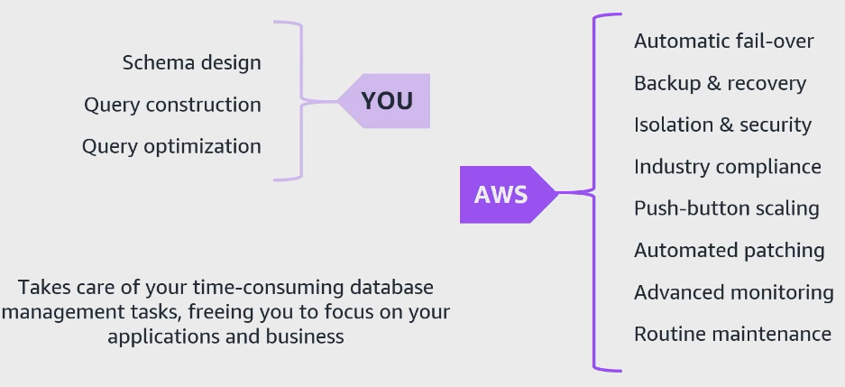
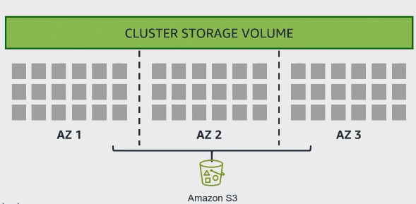
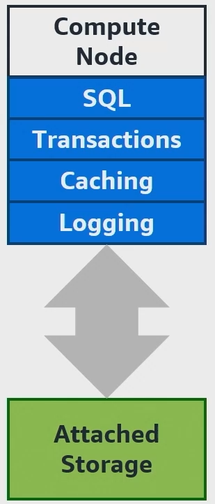
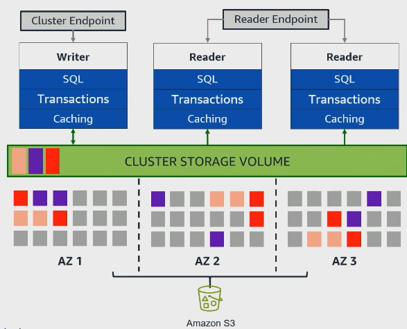
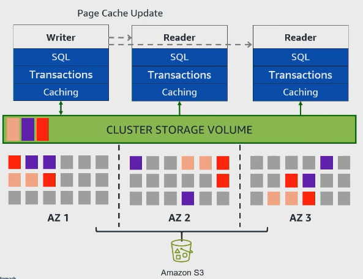
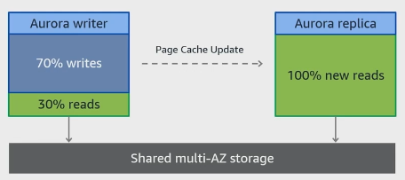

# Amazon Aurora
Se trata de um serviço que é um database completamente gerenciado pela AWS

É, basicamente, uma engine que performa as operações em nosso database para nós

Se responsabiliza por:
+ Manter os dados disponíveis
+ Manter os dados seguros
+ Performar de forma mais próxima do ótimo

É compatível com:
+ MySQL 
+ PostgreSQL
+ MariaDB
+ Oracle
+ MS SQL Server
+ IBM Db2

## Usos Comuns
+ OLTP
+ Aplicações Web
+ SaaS
+ Databases empresariais usando Fleet Manager
+ Plataformas de e-commerce
+ Sistemas de gerenciamento de conteúdo

**Possui uma engine de armazenamento de logs estruturados (WAL - discutido mais a frente) que aumenta sua performance** se comparado a engines tradicionais de databases

## Benefícios de Uso 
+ Elimina a necessidade de gerenciarmos a infraestrutura do database 
+ Fornece alta disponibilidade e escalabilidade global
+ Garante durabilidade de dados
+ Seu log estruturado faz com que tenhamos um alto throughput e baixa latência 

## Características
+ **Até 15 replicas de leitura por cluster** com baixa latência
+ Armazenamento escala de modo automático de 10 GB ate 128 TB
+ Se recupera sozinho de falhas de hardware
+ Dados são criptografados no tráfego e no rest se integrado com AWS KMS
+ Fornece a API do Amazon RDS para uma interface segura
+ Se integrarmos com o Amazon Redshift podemos operar OLAP em NRT
+ Realiza backups com point-in-time
+ Possiblita clonar a database de forma rápida
+ Se usado MySQL podemos realizar backtracking
+ Nos permite de forma nativa criar réplicas em Availability Zones (AZ)

## Pricing
Pay-as-you-go

Fatores que influenciam:
+ Tipo de instância escolhida
+ Quantidade de armazenamento necessário
+ Quantidade de operações I/O que são performadas

## Conceitos
### Aurora DB Cluster
É a principal unidade de arquitetura do Aurora 

Composto de:

#### Primary (Writer) Instance
Lida com todas as **operações de escrita e lê requests** feitos ao cluster do database 

Podemos ter somente **um por cluster**

A instancia de escrita (Primary Instances) atua escrevendo Logs estruturados no armazenamento no modelo Write-Ahead Log (WAL)

#### Secondary (Reader) Instance
Performa **operações de leitura** de modo escalável

Cada leitura realiza a operação sobre uma página (page) sob demanda que é materializada no background do Amazon Aurora

Podemos ter **até 15 replicas** dessa instância para otimizar a performance

**Qualquer Secondary Instance pode ser promovida para Primary Instance em situações de quebra/colapso do Primary Instance**

A determinação de qual Secondary Instance irá atuar como Primary Instance depende do **Failover Tier**, um valor númerico que dita a preferência por esse comportamento. **Quanto mais baixo o valor, maior a prioridade**

**Primary Instances serão substituídas por novas Secondary Instances**

#### Cluster Volume
Se trata do **armazenamento virtual** da databases

Pode ser expandido para varias AZ, cada um contendo uma copia dos dados do cluster do database 

O armazenamento é segmentado em **Nodes de armazenamento**, cada um com um **SSD de 10 GB atrelado a ele**

Há manutenção contínua do seu armazenamento no Amazon S3 via backup

Analisando de modo mais granular podemos observar a seguinte estrutura de armazenamento:

Podemos observar que cada segmento de dado armazenado **possui replicas em AZ + 1 diferentes** protegendo contra falhas

Cada bloco colorido representa um **Protection Group (PG) que atua replicando os dados em diferentes AZ**. No caso acima temos 6 Nodes de armazenamento para cada PG totalizando 60 GB

**O volume de armazenamento se expande e comprime de modo automatico podendo chegar a 128 TB**

Realiza o backup de modo contínuo, e sem afetar a performance, dos WAL e pages

Podemos ter no máximo 6 cópias de dados para aumentar a durabilidade

Podemos criar clones dos nossos databases para, por exemplo, testes

O processo de **copy-on-write** somente ocorre em situações em que os Cluster Volumes originais e clones diferem entre si, **em situações como essa o armazenamento é cobrado**

**Amazon Aurora realiza a criação de snapshots e reorganiza a database**

### Endpoints
Se tratam de pontos de conexão de nosso cluster 

#### Cluster Endpoint 
Permite a **conexão com a Primary Instance** para performar operações de leitura e escrita 

#### Reader Endpoint 
**Realiza operações de Load Balancer de modo a gerenciar o tráfego de requests entre as Secondary Instances**

#### Instance Endpoint
**Permite a conexão em uma instancia de database específica**

#### Custom Endpoint
Uma forma de customizarmos a conexão com um grupo seleto de instancias

Podemos dar acesso a um grupo de pessoas específicas para performar operações de I/O, por exemplo, num endpoint dedicado a somente elas

#### Aurora Global Database Endpoint
Realiza a conexão, em situações de deploy global, à Primary Instance

### Quorum Model
Abordagem de verificar a consistencia ao longo de multiplas copias do database 

Requer de um "acordo" com a maioria dos nodes de armazenamento que contem os Cluster Volumes

A escrita exige reconhecimento de pelo menos 4 de 6 cópias, garantindo forte consistência

Para leitura 3 cópias dos WALs durante recovery são necessárias

### Aurora Serverless
Opera de modo Serverless dessa forma não precisamos nos preocupar com dimensionamento de recursos

### Aurora Global Database
Permite que uma única database possa ser replicada em múltipĺas regiões tornando mais resiliente e tolerante a falhas

## Levar em Conta ao Implementar
### Segurança e Gerenciamento
Fazer uso de VPC para trafegar os dados via rede 

Podemos integrar com IAM para termos controle granular de acessos

É recomendado o uso de Amazon GuardDuty para identificar potenciais ameaças de forma inteligente

### Monitoramento e Logging 
Devemos monitorar suas métricas e Logs para termos uma visibilidade ampla de como e quem está acessando a database  

### Gerenciamento Operacional
Devemos nos atentar a:
+ Entender o backup automatico e features de recovery
+ Opções de point-in-time recovery
+ Habilidade de criação de replicas de leitura para melhorar a escalabilidade e recuperação de desastres

## Integração
### AWS Lambda
Podemos invocar eventos que realizam a execução de procedures e triggers

### Amazon S3
Podemos carregar e armazenar snapshots e backups no S3

### AWS IAM
Podemos controlar o acesso ao database 

### Amazon CloudWatch 
Podemos fazer upload de métricas e auditar seus logs 

### Amazon Sagemaker, Amazon Comprehend e Amazon Bedrock
Podemos fazer inferencia nesses serviços diretamente dos dados armazenados no database

## Arquitetura
No geral, **databases consistem em uma série de operações de I/O**

Antes do desenvolvimento de databases como Amazon Aurora o design era realizado pensando somente em:
+ Aumento de bandwidth de I/O
+ Redução do consumo de operações de I/O

Essa arquitetura pode ser esquematizada da seguinte maneira

A arquitetura utilizada anteriormente apresentava limitações como:
+ Escalabilidade 
+ Flexibilidade

Com Amazon Aurora temos a seguinte arquitetura

Nela temos **armazenamento desacoplado do database com o intuito de prover maior escalabilidade, disponibilidade e durabilidade**

Como destacado anteriormente podemos ter 15 instancias de leitura e 1 de escrita em nosso cluster, totalizando 16 instancias operando de modo distribuído

O volume de armazenamento é compartilhado com todas as instancias de leitura

**Os dados armazenados no Amazon Aurora são estruturados em WAL (Write-Ahead Logs)** fazendo com que os dados não sejam armazenados em blocos inteiros ou páginas de dados como em databases tradicionais

Os WALs são constantemente transmitidos via streaming para:
+ Nodes de armazenamento usando paralelismo 
+ Secondary Instance pelo Primary Instance permitindo o uso de cache, denominado de Page Cache Update

Os WALs passados para os Secondary Instances são usados para buffer pool e updates de leitura de views

