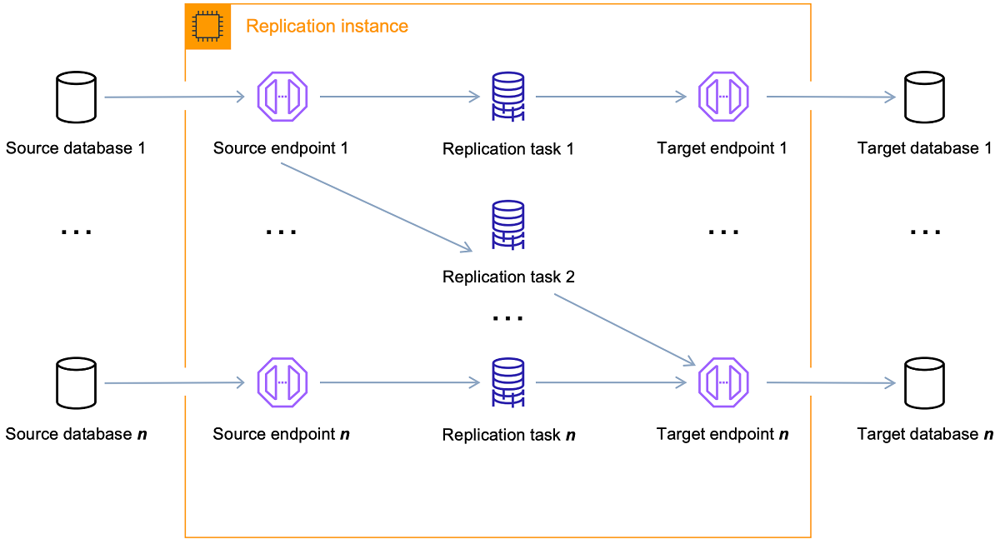

# Do que se trata?

é um **serviço web** que tem como funcionalidade **migrar dados entre endpoints (source e target)**

podemos realizar migrações homogêneas (onde source e target endpoints são do mesmo tipo) ou heterogêneas, onde source e target são de diferentes tipos

**a única obrigatoriedade para funcionar corretamente é que um dos endpoints estejam na AWS**

# Processo de migração de dados

1. conexão com o source endpoint;
2. leitura dos dados no source endpoint;
3. formatação dos dados para consumo no target endpoint;
4. carregamento dos dados no target endpoint.

olhando mais de perto todo esse processo o seguinte esforço é realizado:

**1. bases de dados na rede que são boas candidatas no nosso ambiente de rede para a migração são descobertas;**
**2. ocorre uma conversão automática de schema para garantir a compatibilidade do source para o target;**
**3. ocorre a criação da instancia de replicação;**
**4. os endpoints source e target que possuem informações a respeito do processo são criados e sua conexão testada;**
**5. uma ou mais tarefas de migração são criadas e iniciadas para realizar o processo para nós.**

## Ciclo de vida de uma tarefa de migração

consiste em 3 grandes fases:

1. migração de dados já existentes (full-load)
2. aplicação de mudanças registradas em cache
3. replicação contínua (CDC)

### 1. migração de dados já existentes

se trata do processo de carregar dados que já estavam criados quando o processo de migração se iniciou

na maioria dos casos dados são constantemente criados em um database, **tais mudanças não serão migradas nessa fase**

as mudanças que ocorrem na fase migração são registradas via cache na instancia de replicação (**cached changes**)

**as mudanças não são capturadas nesta etapa**

### 2. aplicação de mudanças registradas em cache

tomando como exemplo uma tabela, **quando tem seu carregamento finalizado**, se inicia o processo de **carregar as mudanças registradas em cache**

após a finalização de todo o carregamento de cache parta esta tabela, a etapa seguinte se inicia que consistem em aplicar as mudanças como transações

### 3. replicação contínua (CDC)

no inicio dessa etapa geralmente é notado um delay de transações entre o source e target endpoints, eventualmente isso atinge um estado estacionário através desse acumulo de transações

# Componentes

## DMS Fleet Advisor (terminará seu suporte em mai/2026)

tem como função realizar a coleta de dados de multiplas databases sem a necessidade de se preocupar com a instalação de sistemas de cada database

baseado nos dados descobertos via nossa rede ele cria um inventário onde podemos revisar e definir quais databases e objetos que queremos monitorar

com esses metadados coletados podemos traçar rotas de qual o melhor caminho para realizar nossa migração

suporta atualmente (set/2025) os seguintes tipos de servidores de bases de dados: 
+ Microsoft SQL Server; 
+ MySQL;
+ Oracle;
+ PostgreSQL.

## DMS Schema Conversion

faz com que nossas migrações heterogêneas de dados sejam mais previsíveis

possui 3 componentes:

1. **data provider** - armazena as credenciais de conexão com o source endpoint;
2. **instance profile** - especifica as conexões de rede e segurança;
3. **migration project** - possui os data providers, instance profile e regras de migração; 

**data providers e instance profile são usados pelo DMS para criar um processo que converte schemas de databases e code objects**

## Replication Instance

de forma simplificada, se trata de uma instancia EC2 que possui tarefas de migração sendo executadas

**uma replication instance pode ter mais de uma migration task atuando simultaneamente**

devemos nos atentar quando trabalhado com **CDC** uma vez que, **dependendo da velocidade com que os dados são escritos no target, dados podem ser escritos no disco, aumentando o consumo de armazenamento** dado que logs são também escritos no disco

quando usado o MultiAZ temos uma maior disponibilidade e resiliencia a falhas uma vez que temos uma outra instância, igual a que estamos usando, em standby em uma diferente Availability Zone (AZ). nesse cenário a replications instance principal constantemente manda seu status para a em standby

temos a opção de usar uma replication instance serverless, nos dando menos trabalho em termos de escalabilidade

## Endpoints

se tratam de onde os dados serão migrados (source) e para onde eles irão (target endpoint)

são definidos, no geral, pelas seguintes informações de cada database:

+ tipo de endpoint (source/target)
+ tipo de engine (oracle, sqlserver, ...)
+ nome do servidor (dns ou ip)
+ porta
+ criptografia
+ credenciais (usuario e senha)

o teste de conexão é obrigatório quando feita a criação do endpoint via console

para o endpoint ser atrelado a uma tarefa de migração sua conexão deve estar estabelecida, isto é, o teste de conexão deve ter retornado sucesso

