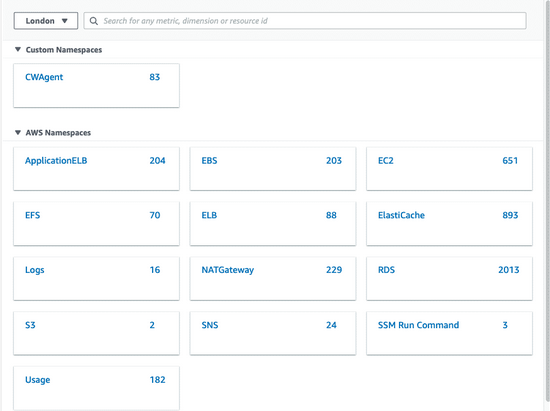
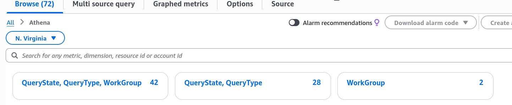
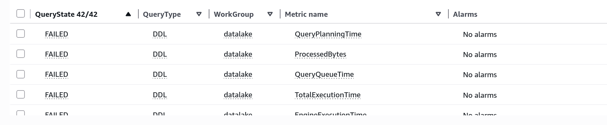
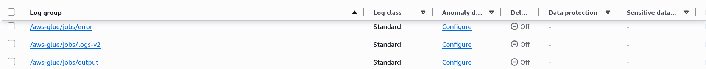

# Amazon CloudWatch
Um serviço de monitoramento, observabilidade, governança e otimização

Podemos usar o CloudWatch para monitorar aplicações na AWS, hospedadas de modo híbrido, em outras clouds ou ainda on-premise

Com o CloudWatch junto de outros serviços como Lambda e EventBridge, podemos automatizar respostas à mudanças operacionais

Podemos com o CloudWatch atuar usando as seguintes features:
    
+ **Trace**
    + nos permite rastrear processos realizados
+ **Logs**
    + monitorar logs
+ **Metrics**
    + coletar e analisar metricas de serviços, recursos e aplicações (CloudWatch Metric Math ou Metrics Insights)
    + podemos usar o CloudWatch Dashboards para tornar nossa visualização mais clara e objetiva
+ **Alarms**
    + setar alarmes em casos que necessitam de atenção

## Arquiteturas
### Outside-in
Essa abordagem tem como **foco a experiência do usuário**, por exemplo, tempo de uma requisição

Podemos fazer uso do **CloudWatch Synthetics** para entender a respeito de **latência e saúde dos recursos envolvidos usando Canary** (uma técnica de deploy DevOps que consiste em reduzir o risco ao introduzir novas versões de uma aplicação testando em um pequeno subconjunto de usuários). O **CloudWatch Synthetics permite testes, como seu próprio nome diz, de forma sintética simulando usuários**  

Podemos usar o **CloudWatch RUM** para **coletar dados de usuários web**, gerando métricas de experiencia do usuário de **forma orgânica**. Podemos rastrear;
+ localização
+ tipo de dispositivo
+ tipo de navegador

Apesar de possuírem diversos tipos de visualização usando o CloudWatch Synthetics e RUM (Real User Monitoring), **podemos consolidar esses dados usando o CloudWatch Dashboard**

Se integrado com SNS e CloudWatch Alarms podemos receber avisos e mensagens de ocorrências no ambiente

### Inside-out
Essa abordagem tem como **foco tratar da manutenção da disponibilidade de aplicações via escalonamento da infraestrutura**

Tomando como exemplo um e-commerce, podemos fazer com que mediante ao tráfego recebido o serviço hospedado num EC2 junto de um Elastic Load Balancer possa escalonar sob demanda, evitando custos desnecessários

Isso pode ser realizado via CloudWatch Metrics

## CloudWatch Metrics 
**São dados de variáveis que impactam a performance dos nossos sistemas e que podemos monitorar**

São definidas por:
+ Nome
+ Namespace
+ Dimensão

Cada métrica possui um identificador único (Nome) e cada data point possui:
+ Um registro de time stamp
+ Unidade de medida (opcional)

Alguns serviços possuem métricas gratuitas e pré-definidas mas podemos criar nossas próprias

Com o uso de métricas podemos gerar gráficos de monitoramento

**Nos oferecem uma forma ordenada em relação ao tempo de como os dados (data points) estão distribuídos**

**Data points são registros captados e agregados que serão armazenados para compor métricas em sua estrutura, permitindo gráficos em função do tempo**

Métricas passíveis de serem coletadas podem ter data points com menos de 1 segundo de resolução. **O tempo de resolução impacta diretamente na retenção dos data points coletados**

### Nomes
É um identificador único da métrica 

**Toda vez que adicionamos um novo Nome criamos uma nova variação da métrica**

### Namespaces
Se tratam de um container do CloudWatch Metrics que isolam as métricas umas das outras evitando erros de agregação estatísticas indesejados

**Devemos especificar uma Namespace para cada data point que desejamos publicar no CloudWatch**

### Dimensões 
Podemos fazer uso de dimensões para estruturarmos os resultados retornados pelo CloudWatch

**São características que descrevem a métrica**

**Ao adicionarmos mais Dimensões em uma Métrica o preço aumenta, pois, a cada par Dimensão-Valor temos uma nova Métrica**

Tem estrutura similar a um Map em Go, contendo key-value onde key = nome e value = valor da métrica 

**É parte fundamental de uma métrica**

Podemos ter até 30 dimensões em uma única métrica

### Search Expressions
Se trata de uma forma de agregarmos matematicamente métricas gerando uma nova métrica

Podemos criar **Search Expressions dinâmicas** que agrupam automaticamente Metrics de um Namespace e Dimension de modo automático mesmo que na criação da Search Expression a métrica não exista ainda

**Podemos somente usar de Search Expressions em recursos que tem dados de monitoramento rastreados com pelo menos 2 semanas**

### Annotations
Horizontal Annotations permite identificar de forma rápida quando um valor da métrica foi atingido ou está dentro de um dado intervalo

Vertical Annotations permite marcar metas em um gráfico

### Resolução dos data points de acordo com o tempo de coleta X Tempo de retenção
Após a coleta dos data points eles são armazenados de acordo com o intervalo de coleta desses dados eles são agregados para otimizar o armazenamento, mas isso acarreta numa perda de precisão dos dados

A perda de precisão ocorre como expressado abaixo, isto é, se temos um data point que tem resolução inferior a 60 segundos, seus dados terão sua resolução armazenada por 3h, após 3 horas temos uma precisão de 1 minutos por 15 dias, após 15 dias temos uma precisão de 5 minutos por 63 dias e assim por diante

+ \> 60 s -> disponibilidade por 3h sem perda de resolução
+ 1 min -> 15 dias sem perda de resolução
+ 5 min -> 63 dias sem perda de resolução
+ 1 h -> 455 dias (15 meses) sem perda de resolução

### Filtros
Podemos implementar filtros de métricas usando JSONPath

**São atrelados aos CloudWatch Log Groups**

## CloudWatch Logs
É um registro de atividade gravado pela aplicação ou recurso em questão

**Sua retenção é, por padrão, indefinida, sendo armazenados permanentemente**

Podemos controlar com granularidade de Log Groups como se dará o tempo de retenção destes logs possuindo o mínimo de 1 dia e máximo de 10 anos 

**Logs expirados são deletados automaticamente**

**O CloudWatch Logs Insights descobre automaticamente campos em logs de outros serviços AWS** como por exemplo:
+ Amazon Route53
+ AWS Lambda
+ AWS CloudTrail
+ Amazon Virtual Private Cloud (VPC)
+ **Qualquer outra aplicação ou log customizado que emita eventos de log no formato JSON**

### Log Streams
São sequências de logs que compartilham da mesma fonte

**Cada Log Stream deve pertencer a um Log Group**

### Log Groups
Definem grupos de Log Streams que compartilham do memso tempo de retenção, monitoramento e configurações de controle de acesso

## CloudWatch Synthetics
Permite testes, como seu próprio nome diz, de forma sintética simulando usuários permitindo detectar falhas, latência, quedas de performance, disponibilidade e funcionalidades antes dos usuários

**Ao alterar o status de um Canary um evento é emitido** que se conciliado com o Amazon EventBridge Event Pattern podemos performar ações específicas

O uso de CloudWatch Synthetics gera a produção de arquivos HAR (HTTP Archive) que rastream a interação do browser com a aplicação e são armazenados em Buckets. **Arquivos HAR são valiosos em momentos em que precisamos debugar problemas de performance e/ou de renderização**

**O Canary opera usando Lambda** como serviço de execução de suas funções

## CloudWatch RUM (Real Users Monitoring)
Juntos dos dados provenientes do CloudWatch Synthetics podemos ter uma visão geral da aplicação

**Se correlaciona com a nossa infra e aplicação via integração do X-Ray, CloudWatch Metrics e ServiceLens**

Podemos analisar o uso e impacto do uso em nossa aplicação de modo visual permitindo observar a **localidade, navegador, dispositivos, latências e updates da aplicação**, por exemplo

Com o uso do RUM podemos ter acesso a **mensagens de erros, dados de sessão dos usuários e traces do X-Ray** permitindo a otimização da aplicação

**O código gerado para extração dos dados é em JS**

**Para realizarmos a agregação dos dados é necessário habilitarmos cookies**

Funcionamento:

## CloudWatch Container Insights
É um recurso do Amazon CloudWatch que **monitora a saúde, o desempenho e a utilização de contêineres**

Rastreia dados de desempenho (métricas, como utilização de CPU e memória) e registros de eventos (logs) gerados pelos seus contêineres

O CloudWatch cria dashboards automaticamente para fornecer uma visão imediata e abrangente da performance dos seus contêineres

Console do Container Insights se trata de uma visualização especializada no console do CloudWatch, otimizada especificamente para mostrar métricas, logs e eventos de clusters e contêineres

Funcionamento

## CloudWatch Agent
Permite coletar dados de logs de modo individual ou em grupos de arquivos

Após a coleta, os logs são enviados a um log stream que usam do ID do recurso como nome padrão, esse ID está dentro de um log group previamente configurado

Exemplo de uso em EC2:

Exemplo de uso em containers:

+ ECS:
    + Devemos configurar e fazer o deploy de um CloudWatch Agent como um daemon task
+ EKS:
    + Devemos configurar e fazer o deploy de um CloudWatch Agent como um daemon set
 

## CloudWatch Contributor Insights
Nos fornece informações de quem ou o que esta impactando nosso sistema com base em Logs destacando outliers, detectando grandes padrões de tráfego e rankeando processos dos sistemas em função do tempo e em tempo real 

**Um Contributor se trata de um combinação de campos definidos por uma regra**

**Ganhamos um maior grau de isolamento para diagnosticar e remediar nossas operações**

Regras especificam quais campos dos logs devem ser usados para criar Contributors. **Regras obrigatoriamente tem que ter um Log Group e uma Key gerando o Contributor**

As operações matemáticas permitidas são count e sum apenas

## CloudWatch Log Anomalies
Podemos criar detectores de anomalias no ambiente usando esta ferramenta

Ela se enquadra no free-tier se a classe dos Logs usados forem Standard

Há em sua configuração um codigo de ML que é treinado com base em nossos Logs no periodo de 2 semanas para entender o comportamento do ambiente e a partir disso detectar anomalias

## CloudWatch Dashboards
Nos permite a criação unificada de registros de métricas e gráficos do comportamento do ambiente
