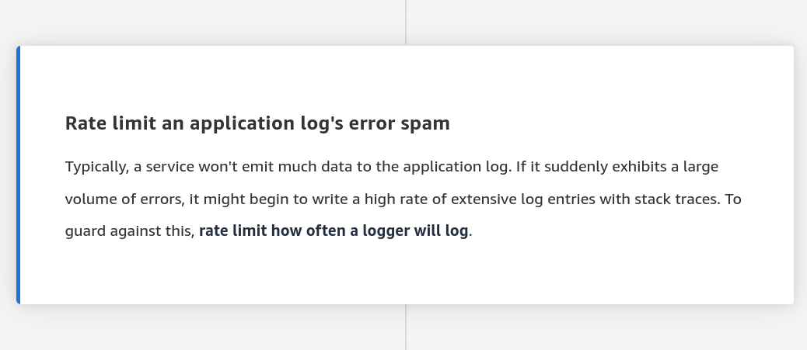
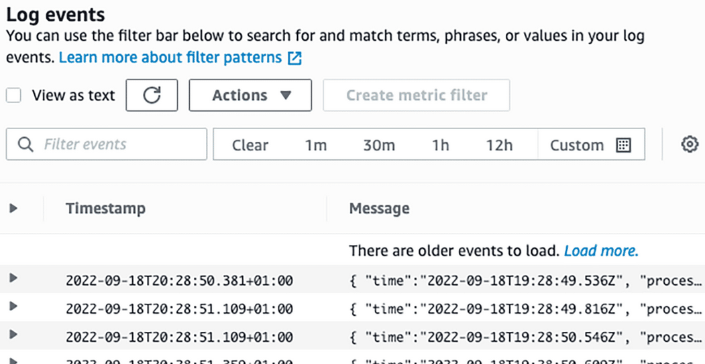

# Implementando Observabilidade
Devemos pontuar o que nos é de interesse e prioridade nos fazendo a seguinte pergunta:
+ O que queremos identificar e otimizar com uso de observabilidade?

Após a identificação do que temos interesse em observar, definimos como esses dados necessários para nossa observabilidade serão ingeridos e quais dados são necessários para atingir a meta definida, evitando ingerir dados desnecessários, que podem comprometer no custo

No processo de ingestão devemos ponderar se o dado será ingerido via Logs ou via Metrics

Devemos criar Alarms somente para o que realmente é necessário e urgente

Devemos mascarar dados sensiveis presentes nos logs antes de exportá-los para o CloudWatch Logs

# Monitoramento vs Observabilidade
Monitoramento se trata de uma porção do que chamamos de observabilidade

Observabilidade é composto de 3 pilares:
+ **Tracing**
    + Nos auxilia a **identificar a causa-raíz** de forma rápida e eficiente
    + Podemos fazer uso de X-Ray
+ **Monitoramento**
    + Nos permite ter **informações de uma aplicação** que não está funcionando adequadamente
    + Podemos fazer uso de CloudWatch Metrics
+ **Logging**
    + Nos dá **informações mais descritivas** do motivo da anomalia
    + Podemos fazer uso de CloudWatch Logs

# Melhores práticas de Logging
Devemos registrar em logs a disponibilidade e latência de todas as dependências, nos ajudando a entender o motivo de um request falhar ou demorar

1. Segmentar métricas de dependências por chamada, recurso ou status code facilitando tirar conclusões 
2. Em situações que operamos usando filas é recomendado que, quando colocamos ou tiramos um objeto da fila registremos isso via log 
3. Adicionar um contador de erros para todas situações de requests que falharam, incluindo mensagens do motivo do erro de forma detalhada
4. Organizar erros em categorias de causas que levaram a eles

**Logs devem conter metadados determinantes para a identificação da causa-raíz do problema**. É recomendado ter dados como quem realizou o request e o que o request tentou executar

**É importante termos um Trace ID e propagá-lo nas chamadas de backend**, principalmente em sistemas distribuídos e de microsserviços, implementando essa prática podemos alinhar os logs de varios sistemas e identificar falhas que ocorreram 

# Amazon CloudWatch
Um serviço de monitoramento, observabilidade, governança e otimização

Podemos usar o CloudWatch para monitorar aplicações na AWS, hospedadas de modo híbrido, em outras clouds ou ainda on-premise

Com o CloudWatch junto de outros serviços como Lambda e EventBridge, podemos automatizar respostas à mudanças operacionais

Podemos com o CloudWatch atuar usando as seguintes features:
    
+ **Trace**
    + nos permite rastrear processos realizados
+ **Logs**
    + monitorar logs
+ **Metrics**
    + coletar e analisar metricas de serviços, recursos e aplicações (CloudWatch Metric Math ou Metrics Insights)
    + podemos usar o CloudWatch Dashboards para tornar nossa visualização mais clara e objetiva
+ **Alarms**
    + setar alarmes em casos que necessitam de atenção

## Arquiteturas
### Outside-in
Essa abordagem tem como **foco a experiência do usuário**, por exemplo, tempo de uma requisição

Podemos fazer uso do **CloudWatch Synthetics** para entender a respeito de latência e saúde dos recursos envolvidos usando de Canary (uma técnica de deploy DevOps que consiste em reduzir o risco ao introduzir novas versões de uma aplicação testando em um pequeno subconjunto de usuários). O **CloudWatch Synthetics permite testes, como seu próprio nome diz, de forma sintética simulando usuários**  

Podemos usar o **CloudWatch RUM** para coletar dados de usuários web, gerando métricas de experiencia do usuário de **forma orgânica**. Podemos rastrear;
+ localização
+ tipo de dispositivo
+ tipo de navegador

Apesar de possuírem diversos tipos de visualização usando o CloudWatch Synthetics e RUM (Real User Monitoring), **podemos consolidar esses dados usando o CloudWatch Dashboard**

Se integrado com SNS e CloudWatch Alarms podemos receber avisos e mensagens de ocorrências no ambiente

### Inside-out
Essa abordagem tem como **foco tratar da manutenção da disponibilidade de aplicações via escalonamento da infraestrutura**

Tomando como exemplo um e-commerce, podemos fazer com que mediante ao tráfego recebido o serviço hospedado num EC2 junto de um Elastic Load Balancer possa escalonar sob demanda, evitando custos desnecessários

Isso pode ser realizado via CloudWatch Metrics

## CloudWatch Metrics 
**São dados de variáveis que impactam a performance dos nossos sistemas e que podemos monitorar**
or long-term storage. For 
São definidas por:
+ Nome
+ Namespace
+ Dimensão

Cada métrica possui um identificador único (Nome) e cada data point possui:
+ Um registro de time stamp
+ Unidade de medida (opcional)

Alguns serviços possuem métricas gratuitas e pré-definidas mas podemos criar nossas próprias

Com o uso de métricas podemos gerar gráficos de monitoramento

**Nos oferecem uma forma ordenada em relação ao tempo de como os dados (data points) estão distribuídos**

**Data points são registros captados e agregados que serão armazenados para compor métricas em sua estrutura, permitindo gráficos em função do tempo**

Métricas passíveis de serem coletadas podem ter data points com menos de 1 segundo de resolução. **O tempo de resolução impacta diretamente na retenção dos data points coletados**

### Nomes
É um identificador único da métrica 

**Toda vez que adicionamos um novo Nome criamos uma nova variação da métrica**

### Namespaces
Se tratam de um container do CloudWatch Metrics que isolam as métricas umas das outras evitando erros de agregação estatísticas indesejados

**Devemos especificar uma Namespace para cada data point que desejamos publicar no CloudWatch**

O Namespace padrão é o CWAgent

### Dimensões 
Podemos fazer uso de dimensões para estruturarmos os resultados retornados pelo CloudWatch

**São características que descrevem a métrica**

**Ao adicionarmos mais Dimensões em uma Métrica o preço aumenta, pois, o par Dimensão-Valor gera uma nova Métrica**

Tem estrutura similar a um Map em Go, contendo key-value onde key = nome e value = valor da métrica 

**É parte fundamental de uma métrica**

Podemos ter 30 dimensões em uma única métrica

### Search Expressions
Se trata de uma forma de agregarmos matematicamente métricas gerando uma nova métrica

Podemos criar **Search Expressions dinâmicas** que agrupam automaticamente Metrics de um Namespace e Dimension de modo automático mesmo que na criação da Search Expression a métrica não exista ainda

**Podemos somente usar de Search Expressions em recursos que tem dados de monitoramento rastreados com pelo menos 2 semanas**

### Annotations
Horizontal Annotations permite identificar de forma rápida quando um valor da métrica foi atingido ou está dentro de um dado intervalo

Vertical Annotations permite marcar metas em um gráfico

### Resolução dos data points de acordo com o tempo de coleta X Tempo de retenção
Após a coleta dos data points eles são armazenados. De acordo com o intervalo de coleta desses dados eles são agregados para otimizar o armazenamento, ams isso acarreta numa perda de precisão dos dados

A perda de precisão ocorre como expressado abaixo, isto é, se temos um data point que tem resolução infetrior a 60 segundos, seus dados terã sua resolução armazenada por 3h, após 3 horas temos uma precisão de 1 minutos por 15 dias, após 15 dias temos uma precisão de 5 minutos por 63 dias e assim por diante

+ > 60 s -> disponibilidade por 3h sem perda de resolução
+ 1 min -> 15 dias sem perda de resolução
+ 5 min -> 63 dias sem perda de resolução
+ 1 h -> 455 dias (15 meses) sem perda de resolução

### Filtros
Podemos implementar filtros de métricas usando JSONPath

**São atrelados aos CloudWatch Log Groups**

## CloudWatch Logs
É um registro de atividade gravado pela aplicação ou recurso em questão

**Sua retenção é, por padrão, indefinida, sendo armazenados permanentemente**

Podemos controlar com granularidade de Log Groups como se dará o tempo de retenção destes logs possuindo o mínimo de 1 dia e máximo de 10 anos 

**Logs expirados são deletados automaticamente**

### Log Streams
São sequências de logs que compartilham da mesma fonte

**Cada Log Stream deve pertencer a um Log Group**

### Log Groups
Definem grupos de Log Streams que compartilham do memso tempo de retenção, monitoramento e configurações de controle de acesso

## CloudWatch Synthetics
Permite testes, como seu próprio nome diz, de forma sintética simulando usuários permitindo detectar falhas, latência, quedas de performance, disponibilidade e funcionalidades antes dos usuários

**Ao alterar o status de um Canary um evento é emitido** que se conciliado com o Amazon EventBridge Event Pattern podemos performar ações específicas

O uso de CloudWatch Synthetics gera a produção de arquivos HAR (HTTP Archive) que rastream a interação do browser com a aplicação e são armazenados em Buckets. **Arquivos HAR são valiosos em momentos em que precisamos debugar problemas de performance e/ou de renderização**

**O Canary opera usando Lambda** como serviço de execução de suas funções

## CloudWatch RUM (Real Users Monitoring)
Juntos dos dados provenientes do CloudWatch Synthetics podemos ter uma visão geral da aplicação

**Se correlaciona com a nossa infra e aplicação via integração do X-Ray, CloudWatch Metrics e ServiceLens**

Podemos analisar o uso e impacto do uso em nossa aplicação de modo visual permitindo observar a **localidade, navegador, dispositivos, latências e updates da aplicação**, por exemplo

Com o uso do RUM podemos ter acesso a **mensagens de erros, dados de sessão dos usuários e traces do X-Ray** permitindo a otimização da aplicação

**O código gerado para extração dos dados é em JS**

**Para realizarmos a agregação dos dados é necessário habilitarmos cookies**

Usos comuns do RUM:

Funcionamento:

## CloudWatch Container Insights
É um recurso do Amazon CloudWatch que **monitora a saúde, o desempenho e a utilização de contêineres**

Rastreia dados de desempenho (métricas, como utilização de CPU e memória) e registros de eventos (logs) gerados pelos seus contêineres

O CloudWatch cria painéis automaticamente para fornecer uma visão imediata e abrangente da performance dos seus contêineres

Console do Container Insights se trata de uma visualização especializada no console do CloudWatch, otimizada especificamente para mostrar métricas, logs e eventos de clusters e contêineres

Funcionamento

## CloudWatch Agent
Permite coletar dados de logs de modo individual ou em grupos de arquivos

Após a coleta, os logs são enviados a um log stream que usam do ID do recurso como nome padrão, esse ID está dentro de um log group previamente configurado

Exemplo de uso em EC2:

Exemplo de uso em containers:

+ ECS:
    + Devemos configurar e fazer o deploy de um CloudWatch Agent como um daemon task
+ EKS:
    + Devemos configurar e fazer o deploy de um CloudWatch Agent como um daemon set
 

# AWS Systems Manager

## State Manager
É um serviço seguro e escalável de realizar configurações de gerenciamento de serviços, como por exemplo, EC2

**Realiza o deploy de um CloudWatch Agent**

**Atua fazendo com que nossos EC2 estejam no estado que definimos em sua configuração**

Podemos definir:
+ Configurações de servidor
+ Definição de antivirus
+ Configurações de firewall
+ Dentre outros

Quando é recomendado o uso de CloudWatch Agents?

**Situações que Exigem o Agente CloudWatch**
Situação	Tipo de Dado Coletado	Detalhes / Exemplos
Monitoramento de Servidores AWS EC2 (Métricas In-Guest)	Métricas de Desempenho do Sistema Operacional (OS)	Uso de Memória (RAM), Uso de Espaço em Disco (percentual), Métrica de Swap, Métricas de Processos.
Coleta de Logs de Aplicações e Sistema	Logs Customizados de Arquivos (Application Logs)	Logs de aplicações web (/var/log/httpd/access_log), logs de containers (quando não configurados via drivers nativos), logs de firewalls locais, etc.
Coleta de Métricas Personalizadas	Métricas de Aplicação/Negócio (via StatsD ou collectd)	Tempo de processamento de transações, contagem de usuários ativos em tempo real, métricas de um daemon personalizado, métricas de host via collectd.
Monitoramento de Ambientes Híbridos	Logs e Métricas de Servidores On-Premises	Servidores rodando no seu data center local ou em outra nuvem que precisam enviar dados de desempenho e logs para o CloudWatch.

**Serviços AWS com Logs e Métricas Automáticas**
Serviço AWS	Logs / Métricas Gerenciadas Automaticamente
AWS Lambda	Métricas básicas (Invocações, Duração, Erros, Throttles) e todos os logs de saída padrão enviados para o CloudWatch Logs.
Amazon S3	Métricas de solicitação (via S3 Inventory), logs (via S3 Server Access Logging ou CloudTrail).
Amazon DynamoDB	Métricas de capacidade e taxa de transferência (throughput).
Amazon RDS	Métricas de CPU, Armazenamento, Rede e específicas do Banco de Dados.
Amazon API Gateway	Métricas de API e logs de acesso/execução configurados no stage.
AWS Load Balancers (ALB, NLB)
