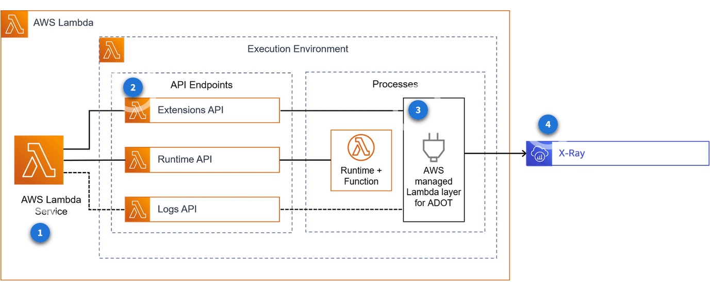

# Amazon Distro for OpenTelemetry (ADOT)
Um projeto open-source criado com o intuito de instrumentalizar softwares para realizar coleta, produção e exportação de dados de telemetria

Se enquadram como dados de telemetria:
+ Metricas
+ Traces
+ Dentre outros

Podemos instrumentalizar:
+ Amazon EC2
+ Amazon ECS
+ Amazon EKS on Amazon EC2
+ AWS Fargate
+ AWS Lambda
+ On premises

## Principais Componentes
### Receiver
Tem como função receber dados via gRPC ou HTTP usando OpenTelemetry Protocol (OTLP)

### Processor
Atuam após a ingestão dos dados e antes de exportar os dados 

Realizam transformações, como adição de metadados, para garantir que o dado trafegue por todo pipeline

### Exporter
Realiza a coleta final dos dados usando o componente ADOT Collector e os exporta para diferentes sistemas ou backends usando OTLP 

## Pipeline
Composto de:
+ Receiver
+ Processor
+ Exporter

Seus componentes podem ser reutilizados em mais de um pipeline 

**Podemos definir métricas no ADOT no formato EMF (Embedded Metric Format)**

**Podemos integrar seus dados com o Amazon CloudWatch para usarmos as suas métricas**

**Podemos usar o ADOT para coletar e enviar dados de aplicações instrumentalizadas com Prometheus**

**Podemos exportar traces para outros backends**

## ADOT em Containers
Podemos ter duas opções de configuração:
+ Sidecar
    + Uma determinada quantidade de instancias será executada contendo ADOT Collector que atua acessando todas as aplicações do sistema
    + Seu deploy é feito em cada Pod 
    + Devemos sempre limitar seu consumo de memória para nao gerar competitividade por recursos
    + Ponto negativo: Maior consumo de recursos pelo ADOT Collector 
+ Service Deployment
    + Os ADOT Collectors se comunicarão por meio de Endpoints
    + Tem seu próprio Deployment.yaml

## ADOT em AWS Lambda
A layer que contém o ADOT, por padrão, é um arquivo config.yaml que exporta os dados de telemtria para o X-Ray

