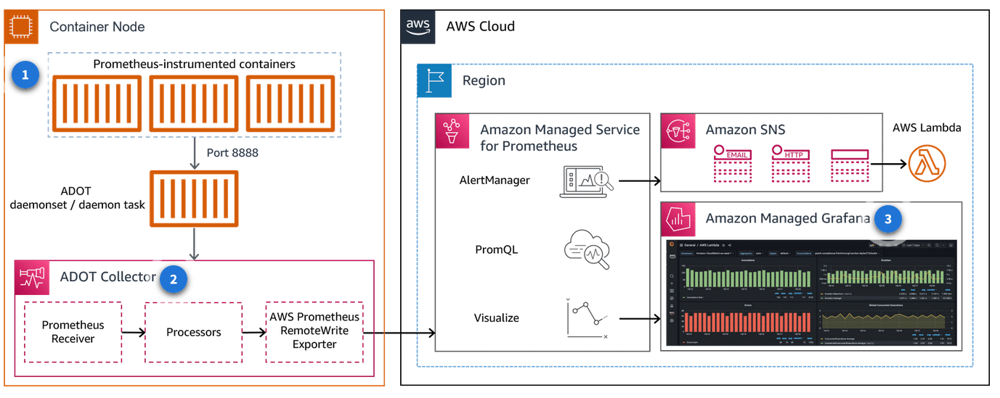

# Amazon Prometheus
Se trata de um serviço que atua coletando dados, definindo métricas e que podem ser consumidos por um outro serviço como o Amazon Grafana ou Amazon CloudWatch

Alguns pontos de atenção:
+ Conforme o aumento do número de series temporais devemos estar atentos com a otimização de sua memória
+ **Não escala horizontalmente em termos computacionais e de armazenamento**, tendo como uma solução possivel performar sharding de metricas
+ Devemos nos atentar à compressão do armazenamento
+ Buld, patch e atualizações de softwares e equipamentos
+ Implementação de governança e segurança

## Benefícios de Uso
1. PromQL permite maior flexibilidade de filtração e agregação de metricas que, por exemplo, Amazon CloudWatch 
2. Podemos setar alarmes mediante a valores de metricas 
3. Ampla gama de métricas 
4. Reduz o custo de subir o Prometheus do zero
5. Integra com ADOT
6. Compatibilidade com Prometheus OSS

## Tipos de Regras
### Recording Rules
Nos permite pré-computar métricas ou expressões frequentemente pesadas e salvar seu resultado como uma série temporal

**Fazer queries no resultado pré-computado geralmente é mais eficiente que rodar a expressão original toda vez**

### Alerting Rules
Podemos definir condições de alerta em PromQL e um limiar

Ao superar o limiar podemos encaminhar o alerta para SNS 

## Componentes Básicos do ADOT Necessários
### Prometheus Receiver
Fornece a capacidade de fazer scraping e relabeling de configurações 

Inclui:
+ Service Discovery
+ Configurações de Scraping 
+ Configurações de Relabeling

### Prometheus Remote Write Explorer
Responsável pela escrita dos dados de telemetria

**Necessita de configuração de autenticação e apontar o Amazon Prometheus como target**

## Prometheus em Containers
Podemos usar o ADOT Collector para captar os logs de uma aplicação instrumentalizada com Prometheus OSS e enviá-las ao Amazon Prometheus

